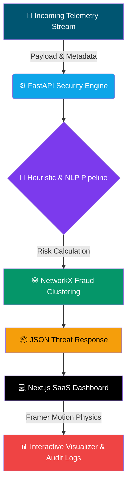

<div align="center">

# 🛡️ AegisTrust Platform
### AI Defense Lab 2026 • Track 2 — Fraud & Identity Defense


<br/>

<p align="center">
  
  
  
  
  
</p>

<p align="center">
  
  
  
  
</p>

<a href="#-quickstart">
  
</a>
<a href="#-key-features">
  
</a>
<a href="#-live-demo">
  
</a>

</div>

<br/>

## 📌 Table of Contents
<details open>
<summary>Click to expand</summary>

- [⚡ Overview](#-overview)
- [🏗️ System Architecture](#️-system-architecture)
- [🚀 Key Features](#-key-features)
- [🎥 Live Demo](#-live-demo)
- [🛠️ Quickstart](#-quickstart)
- [📊 Evaluation Telemetry Example](#-evaluation-telemetry-example)
- [🧭 Roadmap](#-roadmap)
- [🤝 Contributing](#-contributing)
- [📄 License](#-license)

</details>

---

## ⚡ Overview

**AegisTrust** is an enterprise-grade, real-time AI scam message analyzer and threat intelligence command center. Built for **AI Defense Lab 2026 (Track 2: Fraud & Identity Defense)**, the platform moves beyond binary classification with **explainable evidence extraction**, **behavioral velocity scoring**, and a **human-in-the-loop false-positive recovery loop**.

> 💡 **Why it matters:** Most scam detectors give you a score and nothing else. AegisTrust shows *why* — every flagged message comes with an evidence trail an analyst can actually audit.

---

## 🏗️ System Architecture



---

## 🚀 Key Features

<table>
<tr>
<td width="50%">

### 🔍 Multimodal Heuristic Engine
Detects psychological pressure triggers, urgency vectors, and obfuscated phishing URLs in real time.

### ⚖️ Proportional Intervention
Automatically routes threat telemetry into graded responses — **Immediate Block**, **User Warning Banner**, or **Clear**.

</td>
<td width="50%">

### 🔬 Explainable Evidence Audit
Breaks down exact threat components rather than returning a black-box score.

### 🔁 Analyst Review Loop
Integrated feedback mechanism for false-positive/false-negative reporting and full audit logging.

</td>
</tr>
</table>

---

## 🎥 Live Demo

<div align="center">

<!-- Replace with your actual demo GIF or hosted clip -->


*Dashboard reacting live to an incoming scam payload — replace this GIF with your own screen recording.*

</div>

---

## 🛠️ Quickstart

<details open>
<summary><b>📦 Prerequisites</b></summary>

- Python 3.10+
- Node.js v16+

</details>

### 1️⃣ Clone the Repository
```bash
git clone https://github.com/amirthavarshiniCSE/ai-scam-analyzer.git
cd ai-scam-analyzer
```

### 2️⃣ Launch the Backend (FastAPI)
```bash
cd backend
pip install -r requirements.txt
python -m uvicorn main:app --reload
```
> Backend will be live at `http://localhost:8000`

### 3️⃣ Launch the Frontend (Next.js)
Open a second terminal window:
```bash
cd frontend
npm install
npm run dev
```
> Access the Command Center at `http://localhost:3000`

---

## 📊 Evaluation Telemetry Example

| Parameter | Sample Attack Payload | Expected Output |
|---|---|---|
| Sender ID | `HDFC-Alerts-Verify` | 🚩 Gateway Tagged |
| IP Address | `185.220.101.5` | 🕵️ Tor Exit / Proxy Flagged |
| Velocity Score | `0.85` | ⚡ High Velocity Trigger |
| Payload | *"URGENT: Account suspended in 2 hours. Click link..."* | 🔴 **CRITICAL (80/100)** |

---

## 🧭 Roadmap

- [x] Core heuristic + NLP scoring pipeline
- [x] Real-time dashboard with animated risk visualizer
- [ ] Multi-language scam detection
- [ ] Browser extension for inline warnings
- [ ] Public threat-intel API

---

## 🤝 Contributing

Contributions, issues, and feature requests are welcome!

1. Fork the project
2. Create your feature branch (`git checkout -b feature/amazing-thing`)
3. Commit your changes (`git commit -m 'Add amazing thing'`)
4. Push to the branch (`git push origin feature/amazing-thing`)
5. Open a Pull Request

---

## 📄 License

Distributed under the **MIT License**. See `LICENSE` for more information.

<div align="center">

---


**AegisTrust Platform** — Fraud & Identity Defense, done right.

</div>